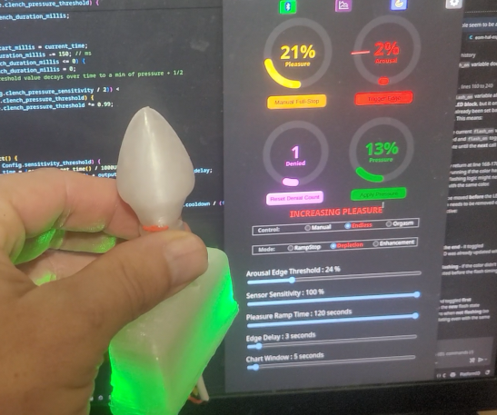

# Building an EOM

Todo: build walkthroughs

# Example builds:

### Tiny tubing build with colored lights (~$60)
- $7 [Waveshare ESP32-S3](https://www.amazon.com/dp/B0CR2RH7PS)
- $28 [MPXV5050GP pressure sensor](https://www.digikey.com/en/products/detail/nxp-usa-inc/MPXV5100GP/2186552) + shipping + tax
- $6 [2mm ID silicone tubing](https://www.amazon.com/Rebower-Silicone-Silicon-Brewing-Aquaponics/dp/B0DSPVD4V7)
- $8 [1100ma battery with jst 1.5 connector](https://www.amazon.com/dp/B0F1FN9BY6)
- $6-$11 [USB battery charger](https://www.adafruit.com/product/6091)([amazon source](https://www.amazon.com/Treedix-Protection-Adjustable-Power-Down-Regulation/dp/B09FJJBLQ1) / [amazon source with data passthrough](https://www.amazon.com/Adafruit-4410-Micro-Charger-LiPoly/dp/B08168GWVJ))
- [3d printed base](../../hardware/plugXS.stl)

---
### Custom PCB (~$150): [Mathew3000/nogasm-esp32](https://github.com/Mathew3000/nogasm-esp32) 
PCB can be ordered online using the files in the repo.  About $150
 

---
### Tiny tubing build with integrated battery (~$60)
- \$8 [Xiao Seeed ESP32-S3](https://www.digikey.com/en/products/detail/seeed-technology-co-ltd/113991114/19285530)  ([$17 on amazon](https://www.amazon.com/ESP32S3-2-4GHz-Dual-core-Supported-Efficiency-Interface/dp/B0BYSB66S5))
- $28 [MPXV5100GP pressure sensor](https://www.digikey.com/en/products/detail/nxp-usa-inc/MPXV5100GP/2186552) \$20 + shipping + tax
- $6 [2mm ID silicone tubing](https://www.amazon.com/Rebower-Silicone-Silicon-Brewing-Aquaponics/dp/B0DSPVD4V7)
- $5 [jst 1.5 connectors](https://www.amazon.com/dp/B07FP2FCYC) 
- $8 [1100ma 102540 battery with jst 1.5 connector](https://www.amazon.com/dp/B0F1FN9BY6)
- [3d printed base](../../hardware/plugXS.stl)

### Small 18650 inflatable build
- $7 [Waveshare ESP32-S3](https://www.amazon.com/dp/B0CR2RH7PS)
- $20 [MPXV5100GP pressure sensor](https://www.digikey.com/en/products/detail/nxp-usa-inc/MPXV5100GP/2186552)
- $15 [inflatable butt plug](https://www.amazon.com/Inflatable-Expandable-Stimulator-Beginners-Detachable/dp/B0DSPKVPM1)
- $20 [battery, charger, and connectors](https://www.amazon.com/dp/B08XZM3NG3)

### Small DIY with all the features (WIP)
- $20 [ESP32-C6 with integrated screen](https://www.amazon.com/dp/B0DHTMYTCY)
- $25 [MPX5100GP pressure sensor](https://www.digikey.com/en/products/detail/nxp-usa-inc/MPX5100GP/464061) (or use the smaller MPXV5100GP if you like)
- $20 [Enema inflatable buttplug](https://www.amazon.com/Inflatable-Congestion-Cleaning-Expansion-Beginner/dp/B0CZRLPLQC)
- An egg electrode (this will connect to your e-stim unit after passing through the plug, not the EOM)
- A small vibrator to fit inside the enema plug
- A transistor to control the vibe with
- A flyback diode to protect the circuit from the motor
- $20 [battery, charger, and connectors](https://www.amazon.com/dp/B08XZM3NG3)
- 3D printed case

### Cheapest possible (~$40 and its usable, but more likely just for testing):
- $15 [inflatable butt plug](https://www.amazon.com/Inflatable-Expandable-Stimulator-Beginners-Detachable/dp/B0DSPKVPM1)
- $12 [generic car exhaust pressure sensor](https://www.amazon.com/dp/B0997VKYQ9)
- $5 [ESP32](https://www.amazon.com/dp/B0F1MS5S8R)
- $7 [18650 cell](https://www.amazon.com/CWUU-9900mAh-Rechargeable-Flashlights-Headlamps/dp/B0D12P7L29)
- $1 [battery holder](https://www.amazon.com/DIANN-10pcs-Battery-Holder-Single/dp/B0BJV7SK5D)
- hot glue and rubber bands, or just use the full length of the tube and let it rest somewhere

